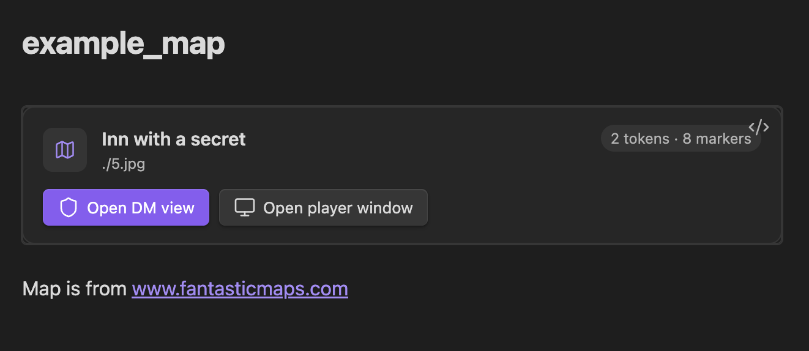
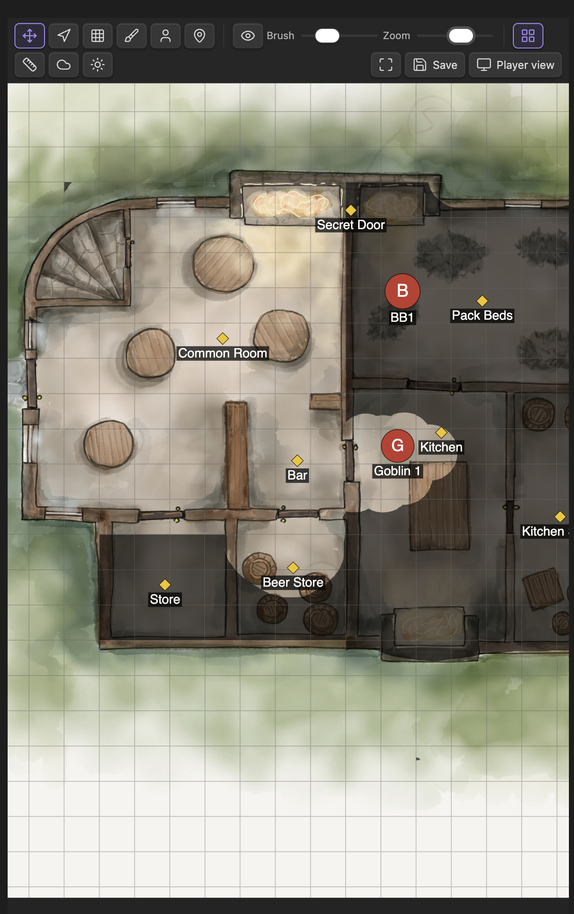
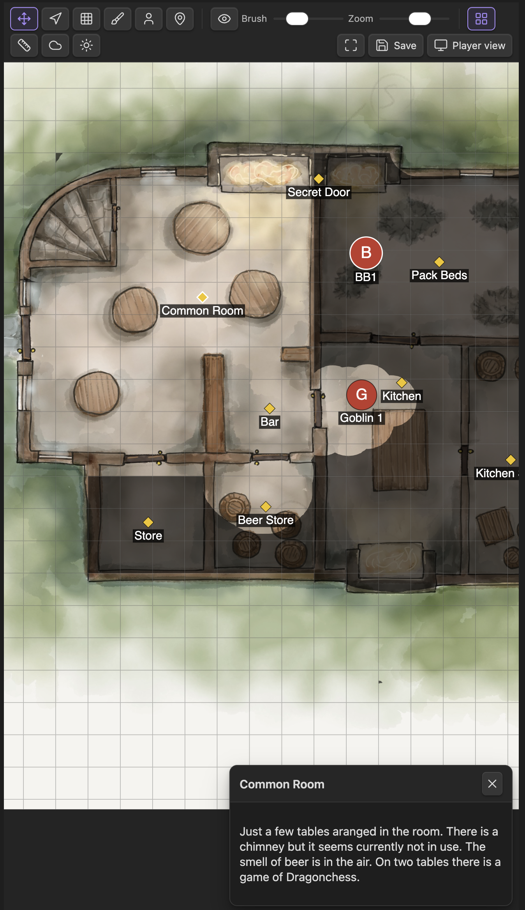
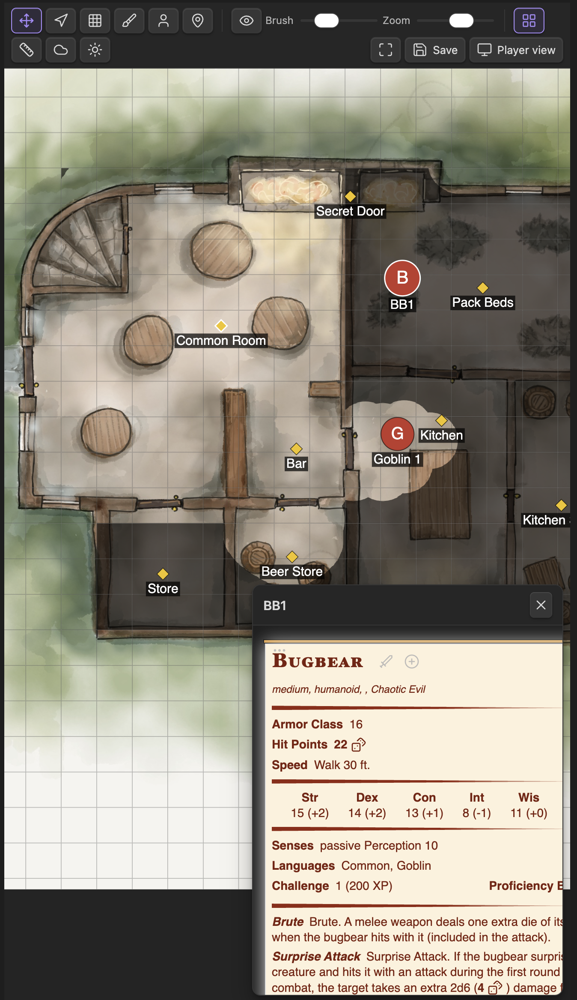
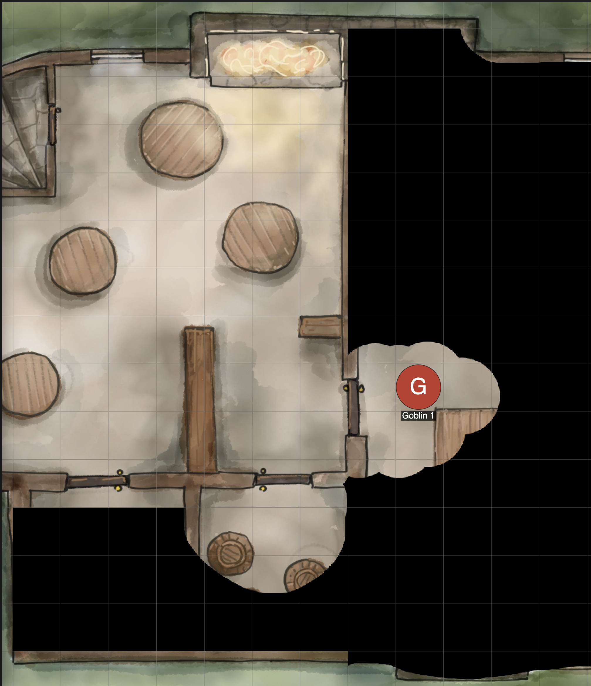
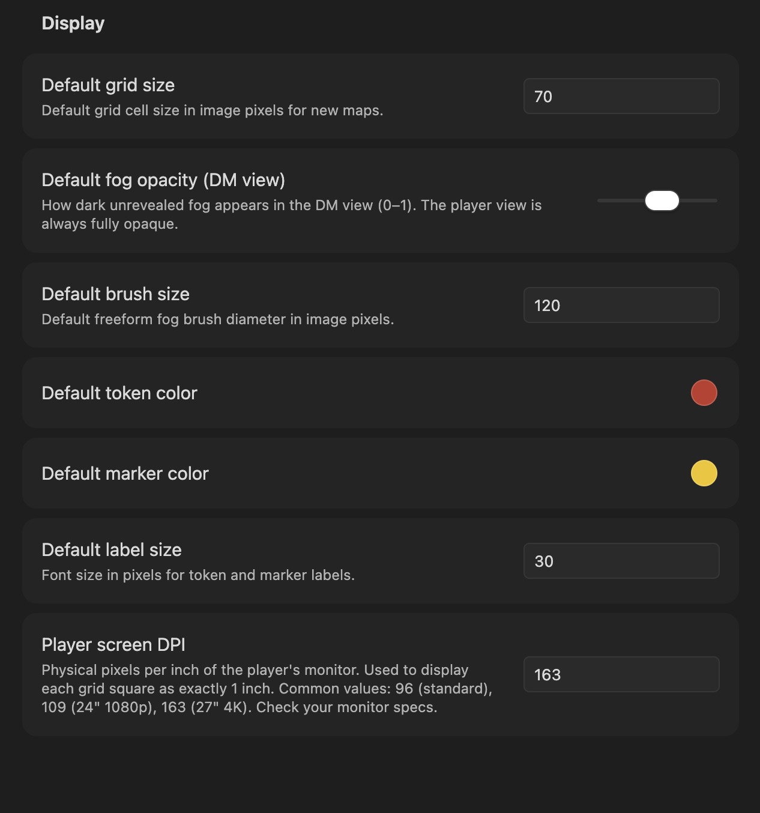

# GM Map

An [Obsidian](https://obsidian.md) plugin for tabletop RPG game masters. Display a map to your players on a second screen with full DM control — including fog of war, DM-only markers, and creature tokens linked to your bestiary.

> **Desktop only** — this plugin requires the Obsidian desktop app.

---

## Table of Contents

- [Features](#features)
- [Screenshots](#screenshots)
- [Quick Start](#quick-start)
- [Code Block Reference](#code-block-reference)
  - [Basic Options](#basic-options)
  - [Grid Options](#grid-options)
  - [Tokens](#tokens)
  - [Markers](#markers)
  - [Spell Areas](#spell-areas)
- [DM View](#dm-view)
  - [Toolbar](#toolbar)
  - [Fog of War](#fog-of-war)
  - [Working with Tokens](#working-with-tokens)
  - [Working with Markers](#working-with-markers)
  - [Working with Spell Areas](#working-with-spell-areas)
  - [Player Pan Control](#player-pan-control)
  - [Grid Alignment](#grid-alignment)
  - [Saving State to the Note](#saving-state-to-the-note)
- [Player View](#player-view)
- [Statblock Integration](#statblock-integration)
- [Plugin Settings](#plugin-settings)
- [State Persistence](#state-persistence)
- [Tips & Tricks](#tips--tricks)
- [Troubleshooting](#troubleshooting)
- [Installation](#installation)
- [Obsidian Developer Policy Disclosures](#obsidian-developer-policy-disclosures)
- [License](#license)
- [Contributing](#contributing)

---

## Features

- **Dual-view layout** — a DM view (with full visibility) and a Player view (showing only what you reveal)
- **Fog of war** — paint and erase fog to reveal the map progressively; two independent modes: grid cells and freeform brush
- **DM-only markers** — place waypoints and notes visible only to the DM, each with an optional longer note and a linked vault note
- **Creature tokens** — drag tokens onto the map and optionally link them to entries in your bestiary
- **Spell area templates** — place D&D area-of-effect shapes (sphere, cone, line, cube) sized in feet; keep them DM-only or reveal them to players
- **Statblock integration** — works with the [Fantasy Statblocks](https://github.com/javalent/statblocks) plugin to display creature statblocks directly from a token
- **Grid overlay** — optional square grid that can be toggled for both DM and Player views simultaneously
- **Player pan control** — the DM can pan the player's view remotely without moving their own viewport
- **Persistent state** — token positions, fog, and markers are auto-saved in a sidecar file; tokens and markers can also be written back into the code block

---

### Screenshots

**Rendered code block in a note** — quick access to DM and Player views, with a live token/marker count.



**DM view** — full map visibility with toolbar, fog layer, tokens, and DM-only markers.



**DM view — marker note panel** — click any marker to read its note in the side panel without leaving the map.



**DM view — statblock panel** — click a token linked to a bestiary creature to see its full statblock inline.



**Player view** — only the areas you have revealed are visible; fog covers the rest.



**Plugin settings** — configure default grid size, fog opacity, brush size, colors, label size, player screen DPI, and optional fullscreen for the player view.



---

## Quick Start

1. Add a map image to your vault (e.g. `Maps/dungeon.png`).
2. Open or create a note and add the following code block:

   ````markdown
   ```gm-map
   id: my-dungeon
   image: "Maps/dungeon.png"
   grid: 70
   ```
   ````

3. Click the **Open DM view** button that appears in the rendered block, or use the command palette → **GM Map: Open DM view**.
4. Open a second Obsidian window (or split the workspace) and run **GM Map: Open Player view**.
5. Move the Player view window to your second monitor and go full-screen.
6. In the DM view, use the fog tools to reveal areas as the session progresses.

---

## Code Block Reference

All `gm-map` code blocks are written in **YAML**. Every property is optional except `image`.

### Basic Options

| Property | Type | Default | Description |
|---|---|---|---|
| `id` | string | auto-generated | Stable identifier used to store and retrieve dynamic state. Set this explicitly so your fog/token state is preserved even if the note is renamed. |
| `image` | string | *(required)* | Vault-relative path to the map image. Supports PNG, JPEG, WebP, and any other format Obsidian can display. |
| `width` | number | image natural width | Override the canvas width in image pixels. Useful when you want to crop or scale the working area. |
| `height` | number | image natural height | Override the canvas height in image pixels. |
| `fogOpacity` | number (0–1) | `0.6` | How dark unrevealed fog appears **in the DM view only**. The Player view always shows fully opaque fog. |

**Minimal example:**

````markdown
```gm-map
image: "Maps/tavern.png"
```
````

**Full basic example:**

````markdown
```gm-map
id: session-5-dungeon
image: "Maps/dungeon-level-1.png"
width: 2048
height: 1536
fogOpacity: 0.5
```
````

---

### Grid Options

The grid is used both as a visual overlay and to drive the grid-cell fog tool. Each cell in the grid represents one map square (typically 5 ft. in D&D).

| Property | Type | Default | Description |
|---|---|---|---|
| `grid` | number | `70` (plugin setting) | Grid cell size in **image pixels**. Set this to match the grid baked into your map art. |
| `gridOffsetX` | number | `0` | Horizontal offset in image pixels to align the grid with the map art. |
| `gridOffsetY` | number | `0` | Vertical offset in image pixels to align the grid with the map art. |
| `gridOverlay` | boolean | `false` | Whether the grid overlay is visible when the map first opens. |

**Example — aligning a grid to existing map art:**

````markdown
```gm-map
id: keep-ground-floor
image: "Maps/keep.jpg"
grid: 64
gridOffsetX: 12
gridOffsetY: 8
gridOverlay: true
```
````

> **Tip:** Use the **Grid Alignment** panel in the DM toolbar to adjust `gridOffsetX`/`gridOffsetY` interactively. The values are shown live and can be pasted back into the code block.

---

### Tokens

Tokens are circular markers that represent creatures or NPCs on the map. They are visible to both the DM and the players.

Tokens can be authored directly in the code block or placed interactively in the DM view. The **Save to note** button writes the current working set back into the code block.

Each token in the `tokens` array supports these fields:

| Field | Type | Required | Description |
|---|---|---|---|
| `id` | string | no | Stable identifier. Auto-generated if omitted. |
| `x` | number | **yes** | Center position in image pixels (horizontal). |
| `y` | number | **yes** | Center position in image pixels (vertical). |
| `radius` | number | no | Token radius in image pixels. Defaults to half the grid cell size. |
| `label` | string | no | Display name drawn below the token. |
| `color` | string | no | CSS color for the token body (hex, rgb, named). Defaults to the plugin setting. |
| `creature` | string | no | Name of a creature in your Fantasy Statblocks bestiary. Click the token in the DM view to see its statblock. |
| `visible` | boolean | no | Reserved for future use; always `true` for now. |

**Example — a combat encounter:**

````markdown
```gm-map
id: goblin-ambush
image: "Maps/forest-road.png"
grid: 70
tokens:
  - id: goblin-1
    x: 320
    y: 480
    label: "Goblin"
    color: "#27ae60"
    creature: "Goblin"
  - id: goblin-2
    x: 420
    y: 500
    label: "Goblin"
    color: "#27ae60"
    creature: "Goblin"
  - id: bugbear-boss
    x: 600
    y: 350
    radius: 50
    label: "Krug"
    color: "#8e44ad"
    creature: "Bugbear"
  - id: fighter-pc
    x: 200
    y: 480
    label: "Aldric"
    color: "#2980b9"
```
````

---

### Markers

Markers are **DM-only** diamond-shaped pins. They are never shown in the Player view. Use them for hidden room descriptions, trap locations, notes to yourself, or links to detailed vault notes.

| Field | Type | Required | Description |
|---|---|---|---|
| `id` | string | no | Stable identifier. Auto-generated if omitted. |
| `x` | number | **yes** | Position in image pixels (horizontal). |
| `y` | number | **yes** | Position in image pixels (vertical). |
| `label` | string | no | Short label drawn below the marker. |
| `color` | string | no | CSS color for the diamond shape. Defaults to the plugin setting. |
| `note` | string | no | Longer note text shown in the DM side panel when the marker is clicked. May also be a `[[wikilink]]`. |
| `linkedNote` | string | no | Vault-relative path to a note opened in the side panel on click. |

Both `note` (as a `[[wikilink]]`) and `linkedNote` can target a whole note, a single heading section (`#Heading`), or a single paragraph / block (`#^block-id`). Only the referenced section is shown in the side panel.

**Example — dungeon key:**

````markdown
```gm-map
id: dungeon-level-2
image: "Maps/dungeon-l2.png"
grid: 70
markers:
  - id: room-1
    x: 150
    y: 200
    label: "Room 1"
    color: "#f39c12"
    note: "Empty guardroom. Overturned table, dried blood on the floor."
  - id: secret-door
    x: 340
    y: 410
    label: "Secret door"
    color: "#e74c3c"
    note: "DC 15 Perception to notice. Opens into Room 7."
  - id: boss-lair
    x: 720
    y: 580
    label: "Lair"
    color: "#8e44ad"
    linkedNote: "Encounters/Lich Lair.md"
```
````

> **Note:** `linkedNote` opens the referenced note in the DM side panel. Append `#Heading` to show just that section or `#^block-id` to show a single paragraph. The player view is never affected.

---

### Spell Areas

Spell areas are translucent **area-of-effect templates** for spells and other effects. They are authored in the DM view (or the code block) and are **DM-only by default** — set `visible: true` to also show a template on the player view.

Sizes are given in **feet** and scale to the grid using the **Feet per grid cell** setting (D&D standard: one 5 ft. square per cell). The shapes follow the D&D 5e rules for how an area extends from its point of origin:

| `shape` | D&D area | `size` means | `width` | Origin (`x`, `y`) | Aimed by `rotation`? |
|---|---|---|---|---|---|
| `circle` | Sphere / Cylinder (top-down) | **Radius** | — | Center | No (symmetric) |
| `cone` | Cone | **Length** — the far end is exactly this wide | — | Apex (the point) | Yes |
| `line` | Line | **Length** | Line **width** (default 5) | Center of the near end | Yes |
| `cube` | Cube | **Side** length | — | Center of the near face | Yes |

> A cone's width at any point equals its distance from the origin, so a 30 ft. cone is 30 ft. wide at its far edge. A cube's point of origin lies on one face, so the square extends `size` feet in the direction it is aimed.

Each entry in the `spells` array supports these fields:

| Field | Type | Required | Description |
|---|---|---|---|
| `id` | string | no | Stable identifier. Auto-generated if omitted. |
| `shape` | string | no | One of `circle`, `cone`, `line`, `cube`. Defaults to `circle`. |
| `x` | number | **yes** | Origin position in image pixels (horizontal). |
| `y` | number | **yes** | Origin position in image pixels (vertical). |
| `size` | number | no | Primary dimension in **feet** (radius / length / side). Defaults to `20`. |
| `width` | number | no | Line width in feet (only used by `line`; defaults to `5`). |
| `rotation` | number | no | Facing direction in **degrees** for cone / line / cube (`0` = pointing right). Ignored for circles. |
| `label` | string | no | Text drawn at the origin. |
| `color` | string | no | CSS color. The fill is translucent; the outline is solid. Defaults to the plugin setting. |
| `visible` | boolean | no | When `true`, players also see the template. Defaults to `false` (DM-only). |

**Example — a fireball and a dragon's breath cone:**

````markdown
```gm-map
id: dragon-fight
image: "Maps/cavern.png"
grid: 70
spells:
  - id: fireball
    shape: circle
    x: 700
    y: 500
    size: 20            # 20 ft. radius
    color: "#e67e22"
    label: "Fireball"
    visible: true
  - id: breath
    shape: cone
    x: 300
    y: 300
    size: 60            # 60 ft. cone
    rotation: 35
    color: "#c0392b"
    label: "Fire Breath"
  - id: bolt
    shape: line
    x: 200
    y: 700
    size: 100           # 100 ft. long
    width: 5            # 5 ft. wide
    rotation: 0
    color: "#9b59b6"
    label: "Lightning Bolt"
```
````

---

## DM View

Open the DM view via the **Open DM view** button in the rendered code block, or through the command palette (**GM Map: Open DM view**). The DM view shows the full map with all tokens, all markers, and a semi-transparent fog layer so you can work underneath the fog.

### Toolbar

| Button | Icon | Tool | Description |
|---|---|---|---|
| Pan / select | move | `pan` | Click and drag to pan. Click a token or marker to select it and see its details in the side panel. Drag a selected token or marker to move it. |
| Pan player view | navigation | `player-pan` | Click and drag to scroll the **Player view** without moving your own viewport. |
| Fog: grid cells | grid | `fog-grid` | Click or drag over grid cells to toggle fog. Use the reveal/hide toggle (eye icon) to switch between revealing and hiding. |
| Fog: freeform brush | brush | `fog-brush` | Paint fog with a circular brush. Use the **Brush size** slider to adjust the brush diameter. Use the reveal/hide toggle to switch modes. |
| Add token | user | `token` | Click anywhere on the map to open the token creation dialog. |
| Add marker | map-pin | `marker` | Click anywhere on the map to open the marker creation dialog. |
| Add spell area | sparkles | `spell` | Click an origin point to open the spell-area dialog (shape, size in feet, color, visibility). |

Additional toolbar controls:

- **Eye / Eye-off toggle** — switches between "reveal" mode (paint away fog) and "hide" mode (re-add fog). Applies to both fog tools.
- **Brush size slider** — adjusts the diameter of the freeform brush in image pixels.
- **Snap to grid toggle** (magnet icon) — when active, tokens snap to the nearest grid cell center when placed or dragged. Large creatures whose diameter covers an even number of cells (2×2, 4×4 …) snap to grid corners instead, which is the correct position for creatures that straddle four cells. Can be toggled on/off per session; the default is controlled by the **Snap tokens to grid** plugin setting.
- **Grid overlay toggle** (layout-grid icon) — shows or hides the square grid on **both** the DM and Player views simultaneously.
- **Save to note** button — writes the current token and marker positions back into the `gm-map` code block in your note.

---

### Fog of War

The fog system uses two independent layers that are composited together:

1. **Grid layer** — a boolean per-cell grid. Toggle individual cells on and off with the `fog-grid` tool. Efficient for revealing rooms one square at a time.
2. **Brush layer** — a freeform PNG mask painted with the `fog-brush` tool. Useful for organic shapes like cave systems or outdoor areas.

Both layers are always active at the same time. A cell is revealed if *either* the grid cell is revealed *or* the brush has painted over it.

**Workflow example — revealing a dungeon room:**

1. Select the **Fog: grid cells** tool.
2. Make sure the toggle shows **Eye** (reveal mode).
3. Click and drag across the cells that make up the room to reveal them.
4. Switch to **Fog: freeform brush** to touch up edges or reveal corridors smoothly.
5. To re-fog an area (e.g., the players retreat), flip the toggle to **Eye-off** (hide mode) and paint over it.

The fog state is saved automatically to a sidecar file (`.obsidian/plugins/gm-player-map/maps/<id>.json`). It does **not** live in the code block — fog data is too large and binary to embed in Markdown.

---

### Working with Tokens

**Adding a token interactively:**

1. Select the **Add token** (`user`) tool.
2. Click the location on the map where you want to place the token.
3. Fill in the token dialog: label, color, radius, and optionally a creature name from your bestiary.
4. Click **Save**.

**Moving a token:**

1. Switch to the **Pan / select** tool.
2. Click the token to select it (a white ring appears).
3. Drag it to the new position. If **Snap to grid** is enabled, the token snaps to the nearest cell center (or grid corner for large creatures) as you drag.

**Editing or deleting a token:**

1. Select the token with the **Pan / select** tool.
2. The token details appear in the side panel.
3. Click **Edit** to change the label, color, size, or linked creature.
4. Click **Delete** to remove the token.

**Snap to grid:**

The **Snap to grid** toggle (magnet icon in the toolbar) automatically places or snaps dragged tokens to clean grid positions:

- **Medium and smaller creatures** (radius ≤ half a cell, or covering 1×1 / 3×3 cells): center snaps to the **middle** of the nearest cell.
- **Large creatures** (diameter covering 2×2 or 4×4 cells): center snaps to the nearest **grid corner**, correctly positioning the creature over four cells.

The snap tile size is derived from the token's radius relative to the map's `grid` value, so resizing a token and saving re-snaps it automatically on the next placement.

**Linking a token to a bestiary creature:**

When editing a token, type a creature name in the **Creature** field. If [Fantasy Statblocks](#statblock-integration) is installed, a dropdown will suggest matching creatures from your bestiary. Once linked, clicking the token shows the full statblock in the side panel.

---

### Working with Markers

**Adding a marker interactively:**

1. Select the **Add marker** (`map-pin`) tool.
2. Click the location on the map.
3. Fill in the marker dialog: label, color, optional note text, and optionally a linked vault note path.
4. Click **Save**.

**Viewing and editing a marker:**

1. Switch to the **Pan / select** tool.
2. Click the marker diamond to select it.
3. The note (if any) appears in the side panel. If a `linkedNote` is set, the note's content is rendered there.
4. Click **Edit** to change the marker's fields or **Delete** to remove it.

> Markers are **completely invisible to players**. They are never sent to the Player view.

---

### Working with Spell Areas

**Adding a spell area interactively:**

1. Select the **Add spell area** (`sparkles`) tool.
2. Click the origin point on the map (where the spell is centered or cast from).
3. In the dialog, pick a **preset** (e.g. *Fireball — 20 ft sphere*) or choose a **shape** and enter the **size** in feet. For a line, also set its **width**.
4. Optionally set a **label**, **color**, and whether it is **visible to players**.
5. Click **Save**.

**Aiming and moving:**

1. Switch to the **Pan / select** tool.
2. Click the template to select it (a white outline appears).
3. Drag the **body** to move its origin. With **Snap to grid** on, the origin snaps to the nearest grid intersection.
4. For cones, lines, and cubes, drag the **round handle** at the far end to rotate the template toward a target.

**Editing or deleting:**

- **Right-click** a template to open its dialog, where you can change the shape, size, color, visibility, or **Delete** it.

**Showing players:**

Toggle **Visible to players** in the dialog (or set `visible: true` in the code block) to reveal a template on the player view — useful for showing exactly who is caught in a blast. Leave it off to plan privately on the DM view.

> Spell templates are saved with **Save to note** alongside tokens and markers, and persist in the sidecar file between sessions.

---

### Player Pan Control

The **Player pan** tool (`navigation` icon) lets you scroll what the players see without moving your own DM viewport.

1. Select the **Player pan** tool.
2. Click and drag on the map — the Player view pans to match.
3. Switch back to **Pan / select** to resume normal DM navigation.

This is useful when you want to draw the players' attention to a specific area of the map without revealing your own view.

---

### Grid Alignment

If your map image has a grid baked into the artwork, use the **Grid Alignment** panel to align the plugin's overlay grid to the art:

1. Click the **Grid alignment** button (ruler icon) in the toolbar.
2. Drag the **X offset** and **Y offset** sliders until the overlay lines up with the art.
3. Note the values and paste them into `gridOffsetX` / `gridOffsetY` in your code block so the alignment is preserved across sessions.

The grid cell size (`grid`) must also match the pixel size of one map square in the image.

---

### Saving State to the Note

Click **Save to note** in the DM toolbar to write the current token, marker, and spell-area positions back into the `gm-map` code block in your note. This is useful to:

- Version-control a snapshot of the encounter in your session notes.
- Pre-populate a map with tokens that should appear at the start of the next session.
- Share the note with someone else with all positions intact.

> **Important:** Fog state is **not** saved into the note — it lives in a separate sidecar file. Only token, marker, and spell-area data is embedded in the code block.

---

## Player View

Open the Player view via the command palette (**GM Map: Open Player view**). Move the view to your second monitor and make it full-screen.

The Player view:

- Shows **only revealed areas** (fully opaque fog everywhere else).
- Shows creature tokens.
- Shows spell area templates **only** when the DM marked them visible to players.
- **Never** shows DM markers or the DM toolbar.
- Reflects all DM changes in real time: fog reveals, token movements, and grid overlay toggles.
- Can be panned remotely by the DM using the **Player pan** tool.

**Recommended setup:**

1. In Obsidian, open a new window: **View → New window** (or drag a tab out).
2. Open the Player view in that window.
3. Move the new window to your second monitor and press `F11` (or your OS full-screen shortcut).
4. The players only see the second monitor. You retain full control on the primary monitor.

---

## Statblock Integration

GM Map integrates with the [Fantasy Statblocks](https://github.com/javalent/statblocks) community plugin (`obsidian-5e-statblocks`). When that plugin is installed and enabled:

- The token edit dialog shows a searchable dropdown of all creatures in your bestiary.
- Clicking a token that has a `creature` field set renders the full statblock in the DM side panel.
- All creature data stays local — no network requests are made.

**Setup:**

1. Install and enable [Fantasy Statblocks](https://github.com/javalent/statblocks).
2. Import your bestiary (e.g., the SRD monsters or a custom YAML file) via the Statblocks settings.
3. In GM Map, edit any token and start typing in the **Creature** field — matching names will appear in the dropdown.

**Example code block using creature links:**

````markdown
```gm-map
id: throne-room-encounter
image: "Maps/throne-room.png"
grid: 70
tokens:
  - id: vampire
    x: 800
    y: 400
    radius: 45
    label: "Count Strahd"
    color: "#7f0000"
    creature: "Vampire"
  - id: zombie-1
    x: 600
    y: 350
    label: "Zombie"
    color: "#556b2f"
    creature: "Zombie"
  - id: zombie-2
    x: 620
    y: 450
    label: "Zombie"
    color: "#556b2f"
    creature: "Zombie"
```
````

---

## Plugin Settings

Open **Settings → GM Map** to configure global defaults. Per-map overrides in the code block always take precedence.

| Setting | Default | Description |
|---|---|---|
| **Default grid size** | `70` | Default grid cell size in image pixels for new maps that do not specify `grid`. |
| **Default fog opacity (DM view)** | `0.6` | How dark unrevealed fog appears in the DM view (slider 0.1–1). |
| **Default brush size** | `120` | Starting diameter of the freeform fog brush in image pixels. |
| **Default token color** | `#c0392b` (red) | Color applied to new tokens when no `color` is specified. |
| **Default marker color** | `#f1c40f` (yellow) | Color applied to new markers when no `color` is specified. |
| **Default spell color** | `#e67e22` (orange) | Color applied to new spell templates when no `color` is specified. |
| **Feet per grid cell** | `5` | How many feet one grid square represents. Spell areas are sized in feet and scaled to the grid using this value (D&D standard is 5 ft.). |
| **Snap tokens to grid** | enabled | Default state of the snap-to-grid toggle in the DM toolbar. When on, newly placed and dragged tokens snap to grid cell centers (odd-sized creatures) or grid corners (even-sized creatures). |
| **Player screen DPI** | `96` | Physical pixels-per-inch of the player's monitor. Used to scale the map so that one grid cell equals one physical inch on screen (useful for virtual tabletop-style play on a TV or large monitor). Common values: `96` (standard HD), `109` (24″ 1080p), `163` (27″ 4K). |
| **Fullscreen player view** | off | Put the player pop-out window into real OS fullscreen when it opens. If your platform blocks automatic fullscreen, click once inside the player window to enter it; press <kbd>Esc</kbd> to leave. Turn this off if it causes display issues. |

---

## State Persistence

GM Map separates two kinds of state:

| Kind | Where it lives | What it contains |
|---|---|---|
| **Dynamic state** | `.obsidian/plugins/gm-player-map/maps/<id>.json` | Fog mask, live token positions, live marker positions, spell templates, grid overlay flag, player pan position |
| **Declarative state** | The `gm-map` code block in your note | Tokens, markers, and spell templates as authored by you; overrides dynamic state when the code block changes |

**How seeding works:**

When you open a map, GM Map computes a signature of the tokens and markers in the code block. If the signature has changed since the last save (because you edited the note), the code block data re-seeds the working state. If the signature is unchanged, the last saved dynamic state is used — so live edits such as token movements persist across sessions.

This means you can safely edit your code block to add new tokens without losing any fog work. Only the tokens/markers are re-seeded; fog state is always loaded from the sidecar file.

---

## Tips & Tricks

**Use unique, stable IDs.** Always set an explicit `id` in your code block. If you omit it, the plugin auto-generates one from the image path — which will break if you rename the image or the note.

````markdown
```gm-map
id: session-07-crypt      # ← always set this
image: "Maps/crypt.png"
```
````

**Pre-place tokens before the session.** Author all expected encounter tokens in the code block the night before. When you open the map, they will appear ready to go.

**Use a TV as a player screen.** Set **Player screen DPI** in settings to match your TV's pixel density. The plugin will scale the map so each grid square is exactly 1 inch — perfect for placing physical minis on the screen.

**Reveal the whole map instantly.** With the `fog-grid` tool in reveal mode, hold and drag across the entire map to reveal everything in one sweep.

**Re-fog explored areas.** Switch the fog toggle to **Eye-off** (hide mode) and paint over areas the players have left. Useful for dungeon crawls where backtracking should restore the unknown feeling.

**Combine grid and brush fog.** Use grid cells for rooms (clean edges) and the brush tool for organic areas like caves or forests. Both layers composite together seamlessly.

**Link markers to notes.** For complex locations, set `linkedNote` on a marker to point to a detailed encounter note. Clicking the marker in the DM view opens the full note in the side panel — no need to switch tabs.

````markdown
markers:
  - id: dungeon-master-notes
    x: 400
    y: 300
    label: "Room 12"
    linkedNote: "Sessions/Session 7/Room 12 - Oubliette.md"
````

---

## Troubleshooting

**The map image does not appear.**
Make sure the `image` path is relative to the vault root and uses forward slashes. The image must be inside your vault.

```
# Correct
image: "Maps/dungeon.png"
image: "Assets/Maps/city.jpg"

# Wrong — absolute path
image: "/Users/me/pictures/map.png"
```

**Fog / tokens reset after reopening the note.**
Check that your code block has a stable `id`. If the `id` changes (e.g., because you omitted it and renamed the image), the plugin cannot find the saved state. Add an explicit `id` and the issue will not recur.

**The grid does not align with the map art.**
Use the **Grid Alignment** panel (ruler icon in the toolbar) to find the correct `gridOffsetX`/`gridOffsetY` values. Also verify that the `grid` value matches the pixel size of one square in your map image.

**The Player view is blank or not updating.**
Ensure both DM and Player views refer to the same map (same `id`). Both views must be open at the same time; the Player view receives live updates from the DM view only while both are loaded.

**Fantasy Statblocks creatures do not appear in the dropdown.**
Make sure the Statblocks plugin is enabled and your bestiary has been imported. Try reloading Obsidian (`Ctrl/Cmd + R`). The creature dropdown only appears if at least one creature is in the bestiary.

**Saving state is slow or fails silently.**
The plugin writes to `.obsidian/plugins/gm-player-map/maps/`. Ensure your vault is on a writable filesystem and that Obsidian has the necessary permissions.

**Map is not moving for players**
Close GM and player view and open it again.

---

## Installation

### From the Obsidian Community Plugin directory

1. Open **Settings → Community plugins → Browse**
2. Search for **GM Map**
3. Click **Install**, then **Enable**

### Manual installation

1. Download `main.js`, `styles.css`, and `manifest.json` from the [latest release](../../releases/latest)
2. Copy the files into your vault at `.obsidian/plugins/gm-map/`
3. Reload Obsidian and enable the plugin under **Settings → Community plugins**

---

## Obsidian Developer Policy Disclosures

In compliance with the [Obsidian developer policies](https://docs.obsidian.md/Developer+policies), the following disclosures are made:

| Topic | Status |
|-------|--------|
| **Payment required** | No — this plugin is free |
| **Account required** | No — no account needed |
| **Network use** | None — this plugin makes no network requests; all data stays in your vault |
| **File access outside vault** | None — the plugin only reads and writes within your Obsidian vault |
| **Telemetry** | None — no usage data is collected |
| **Ads** | None |
| **Code obfuscation** | None — source code is fully open |

---

## License

This project is licensed under the **MIT License** — see the [LICENSE](LICENSE) file for details.

### Third-party licenses

This plugin is built on top of the [Obsidian Plugin API](https://github.com/obsidianmd/obsidian-api). Obsidian is a trademark of Dynalist Inc. This plugin is an independent community project and is not affiliated with or endorsed by Obsidian.

---

## Contributing

Bug reports and pull requests are welcome. Please open an issue before submitting large changes.
